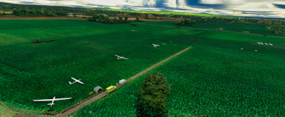

## Microsoft Flight Simulator Airport Extension Community Edition für
# Sonderlandeplatz EDGX Walldorf
🗺📍 https://goo.gl/maps/EoXQDQYC2oFkpo6z7



## Installation

1. Lade die [aktuellste Version](https://github.com/nkappler/EDGX/releases/latest) `EDGX.zip` herunter
2. Finde das Installationsverzeichnis von Microsoft Flight Simulator 2020
3. Entpacke die heruntergeladene Zip-Datei im `Community` Ordner.
4. Die Ordnerstruktur sollte dann so aussehen:
    ```filesystem
    Microsoft Flight Simulator/
    ├─Community/
      ├─EDGX/
        ├─ContentInfo/
        ├─Scenery/
        ├─layout.json
        ├─manifest.json
    ```